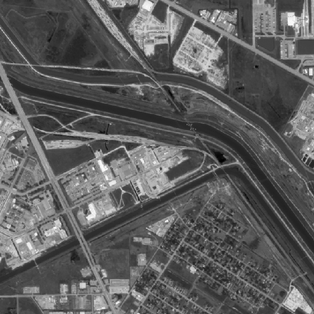

# marblecutter-virtual

I am a tile server for HTTP(S)-accessible [Cloud Optimized GeoTIFFs
(COGs)](http://www.cogeo.org/).

I can also be seen as an example of a virtual `Catalog` implementation, drawing
necessary metadata from URL parameters. For more information, check out [`VirtualCatalog`](virtual/catalogs.py) and [`web.py`](virtual/web.py).

## Running Locally

The easiest way to get a working instance running locally is to use [Docker
Compose](https://docs.docker.com/compose/):

```bash
docker-compose up
```

A tile server will then be accessible on `localhost:8000`. To browse a map
preview, visit
`http://localhost:8000/preview?url=https%3A%2F%2Fs3-us-west-2.amazonaws.com%2Fplanet-disaster-data%2Fhurricane-harvey%2FSkySat_Freeport_s03_20170831T162740Z3.tif`.

URLs (`url` in the query string) must be URL-encoded. From a browser's
JavaScript console (or Node.js REPL), run:

```javascript
encodeURIComponent("https://s3-us-west-2.amazonaws.com/planet-disaster-data/hurricane-harvey/SkySat_Freeport_s03_20170831T162740Z3.tif")
```

If you need to access non-public files on S3, set your environment accordingly
(see `sample.env`), either by creating `.env` and uncommenting `env_file` in
`docker-compose.yml` or by adding appropriate `environment` entries.

## Endpoints

### `/bounds` - Source image bounds (in geographic coordinates)

#### Parameters

* `url` - a URL to a valid COG. Required.

#### Example

```bash
$ curl "http://localhost:8000/bounds?url=https%3A%2F%2Fs3-us-west-2.amazonaws.com%2Fplanet-disaster-data%2Fhurricane-harvey%2FSkySat_Freeport_s03_20170831T162740Z3.tif"
{
  "bounds": [
    -95.46993599071261,
    28.86905396361014,
    -95.2386152334213,
    29.068190805522605
  ],
  "url": "https://s3-us-west-2.amazonaws.com/planet-disaster-data/hurricane-harvey/SkySat_Freeport_s03_20170831T162740Z3.tif"
}
```

### `/tiles/{z}/{x}/{y}` - Tiles

#### Parameters

* `url` - a URL to a valid COG. Required.
* `rgb` - Source bands to map to RGB channels. Defaults to `1,2,3`.
* `nodata` - a custom NODATA value.
* `linearStretch` - whether to stretch output to match min/max values present in
  the source. Useful for raw sensor output, e.g. earth observation (EO) data.

`@2x` can be added to the filename (after the `{y}` coordinate) to request
retina tiles. The map preview will detect support for retina displays and
request tiles accordingly.

PNGs or JPEGs will be rendered depending on the presence of NODATA values in the
source image (surfaced as transparency in the output).

#### Examples

```bash
$ curl "http://localhost:8000/tiles/14/3851/6812@2x?url=https%3A%2F%2Fs3-us-west-2.amazonaws.com%2Fplanet-disaster-data%2Fhurricane-harvey%2FSkySat_Freeport_s03_20170831T162740Z3.tif" | imgcat
```


```bash
$ curl "http://localhost:8000/tiles/14/3851/6812@2x?url=https%3A%2F%2Fs3-us-west-2.amazonaws.com%2Fplanet-disaster-data%2Fhurricane-harvey%2FSkySat_Freeport_s03_20170831T162740Z3.tif&rgb=1,1,1" | imgcat
```


```bash
$ curl "http://localhost:8000/tiles/14/3851/6812@2x?url=https%3A%2F%2Fs3-us-west-2.amazonaws.com%2Fplanet-disaster-data%2Fhurricane-harvey%2FSkySat_Freeport_s03_20170831T162740Z3.tif&rgb=1,1,1&linearStretch=true" | imgcat
```



### `/tiles` - TileJSON

#### Parameters

See tile parameters.

#### Example

```bash
$ curl "http://localhost:8000/tiles?url=https%3A%2F%2Fs3-us-west-2.amazonaws.com%2Fplanet-disaster-data%2Fhurricane-harvey%2FSkySat_Freeport_s03_20170831T162740Z3.tif"
{
  "bounds": [
    -95.46993599071261,
    28.86905396361014,
    -95.2386152334213,
    29.068190805522605
  ],
  "center": [
    -95.35427561206696,
    28.968622384566373,
    15
  ],
  "maxzoom": 21,
  "minzoom": 8,
  "name": "Untitled",
  "tilejson": "2.1.0",
  "tiles": [
    "//localhost:8000/tiles/{z}/{x}/{y}?url=https%3A%2F%2Fs3-us-west-2.amazonaws.com%2Fplanet-disaster-data%2Fhurricane-harvey%2FSkySat_Freeport_s03_20170831T162740Z3.tif"
  ]
}
```

### `/preview` - Preview

#### Parameters

See tile parameters.

#### Example

`http://localhost:8000/preview?url=https%3A%2F%2Fs3-us-west-2.amazonaws.com%2Fplanet-disaster-data%2Fhurricane-harvey%2FSkySat_Freeport_s03_20170831T162740Z3.tif`

## Deploying to AWS Lambda

tk

```bash
make deploy-up
```

or

```bash
make deploy-apex
```
